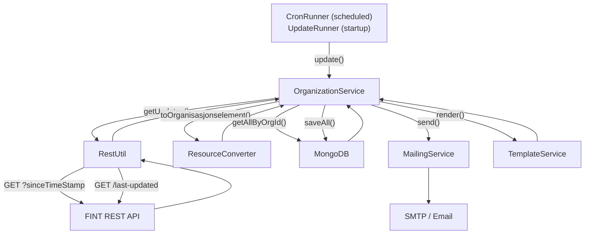
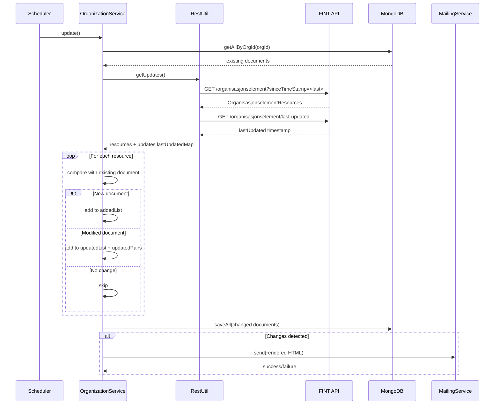
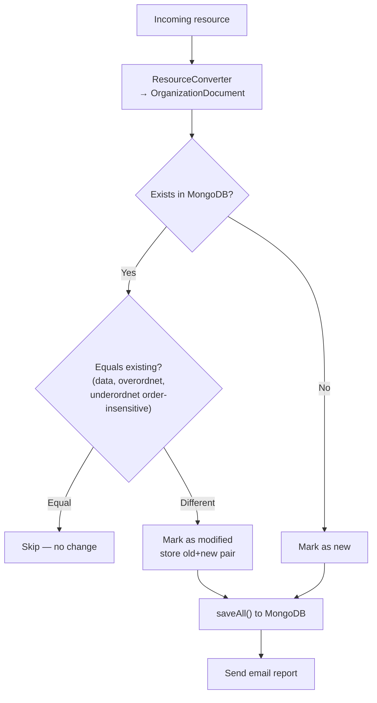

# Data Flow

## High-level overview

```mermaid
flowchart TD
    scheduler["CronRunner (scheduled)\nUpdateRunner (startup)"]
    service["OrganizationService"]
    rest["RestUtil"]
    fint["FINT REST API"]
    converter["ResourceConverter"]
    mongo["MongoDB"]
    mailing["MailingService"]
    template["TemplateService"]
    email["SMTP / Email"]

    scheduler -->|"update()"| service
    service -->|"getUpdates()"| rest
    rest -->|"GET ?sinceTimeStamp"| fint
    rest -->|"GET /last-updated"| fint
    fint --> rest
    rest --> service
    service -->|"toOrganisasjonselement()"| converter
    converter --> service
    service -->|"getAllByOrgId()"| mongo
    mongo --> service
    service -->|"saveAll()"| mongo
    service -->|"render()"| template
    template --> service
    service -->|"send()"| mailing
    mailing --> email
```

## Update cycle detail

```mermaid
sequenceDiagram
    participant Scheduler
    participant OrganizationService
    participant RestUtil
    participant FINT API
    participant MongoDB
    participant MailingService

    Scheduler->>OrganizationService: update()
    OrganizationService->>MongoDB: getAllByOrgId(orgId)
    MongoDB-->>OrganizationService: existing documents

    OrganizationService->>RestUtil: getUpdates()
    RestUtil->>FINT API: GET /organisasjonselement?sinceTimeStamp=<last>
    FINT API-->>RestUtil: OrganisasjonselementResources
    RestUtil->>FINT API: GET /organisasjonselement/last-updated
    FINT API-->>RestUtil: lastUpdated timestamp
    RestUtil-->>OrganizationService: resources + updates lastUpdatedMap

    loop For each resource
        OrganizationService->>OrganizationService: compare with existing document
        alt New document
            OrganizationService->>OrganizationService: add to addedList
        else Modified document
            OrganizationService->>OrganizationService: add to updatedList + updatedPairs
        else No change
            OrganizationService->>OrganizationService: skip
        end
    end

    OrganizationService->>MongoDB: saveAll(changed documents)

    alt Changes detected
        OrganizationService->>MailingService: send(rendered HTML)
        MailingService-->>OrganizationService: success/failure
    end
```

## Change detection

```mermaid
flowchart TD
    incoming["Incoming resource"]
    convert["ResourceConverter\n→ OrganizationDocument"]
    lookup{"Exists in MongoDB?"}
    compare{"Equals existing?\n(data, overordnet,\nunderordnet order-insensitive)"}
    skip["Skip — no change"]
    update["Mark as modified\nstore old+new pair"]
    add["Mark as new"]
    save["saveAll() to MongoDB"]
    notify["Send email report"]

    incoming --> convert --> lookup
    lookup -->|Yes| compare
    lookup -->|No| add
    compare -->|Equal| skip
    compare -->|Different| update
    update --> save
    add --> save
    save --> notify
```
